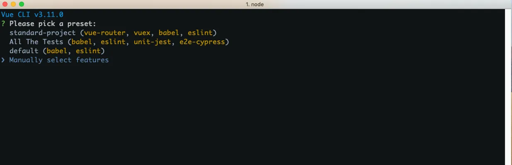
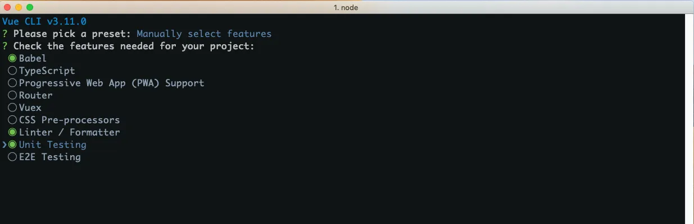
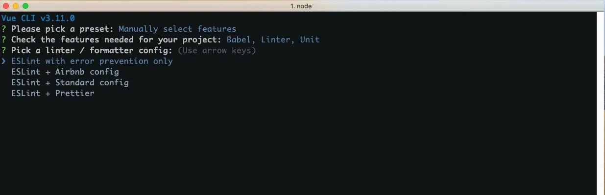
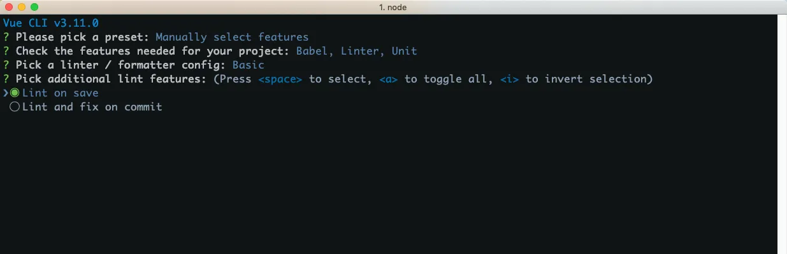
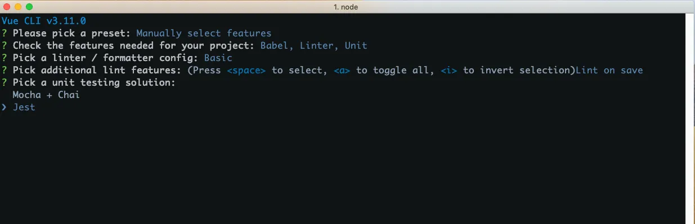
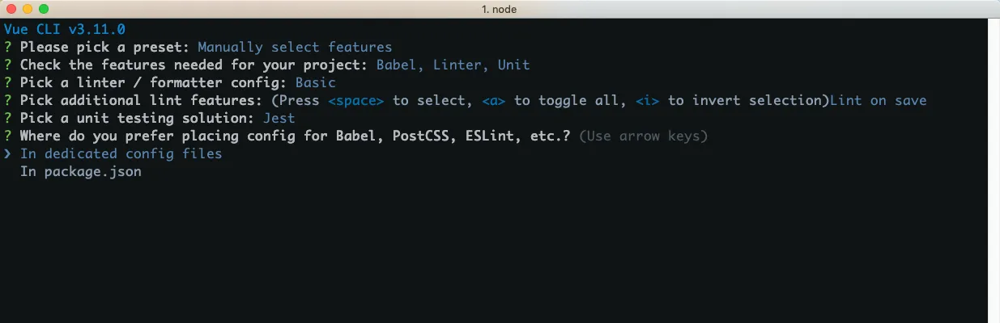
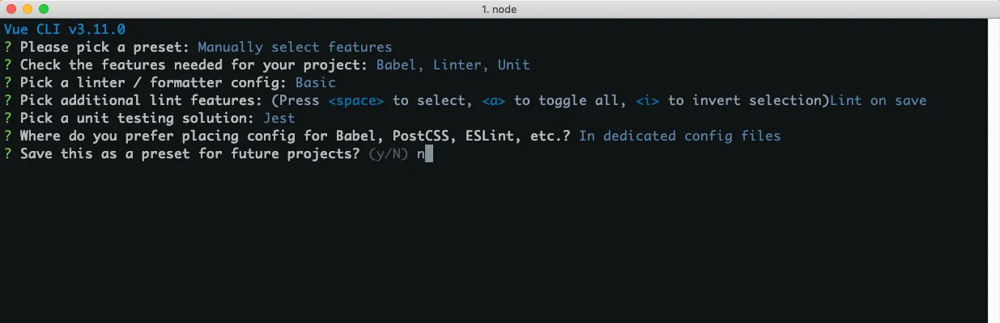
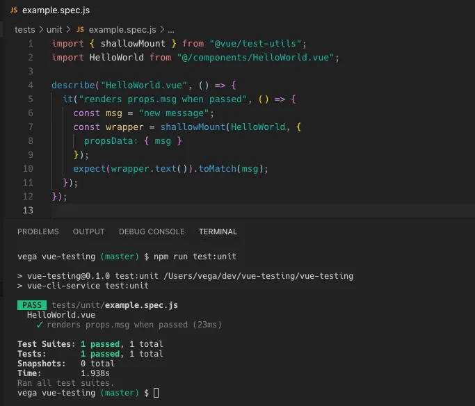
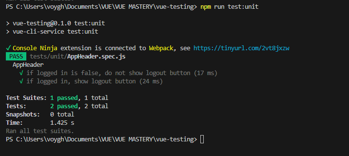
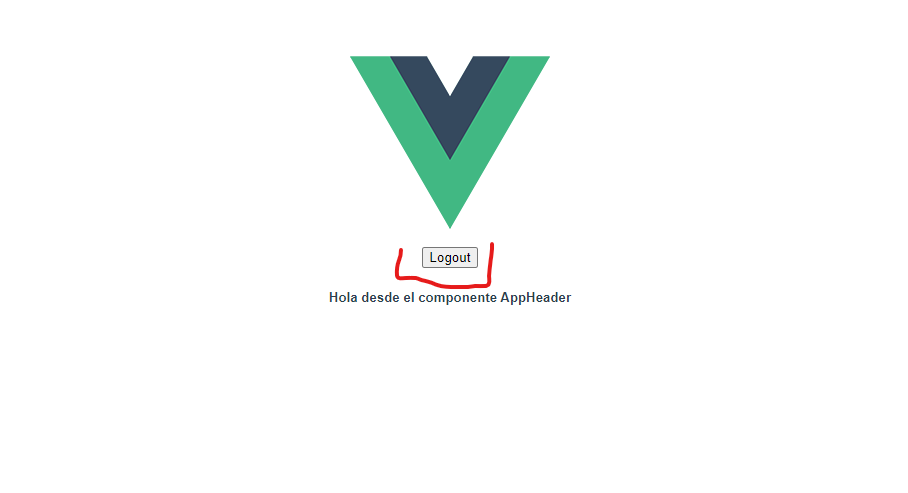

# Pasos para crear la app desde cero

### Instalar vue
vue create vue-testing - CREAR INSTALACION MANUAL

- Seleccionar configuracion manual



- Seleccionar Unit Testing



- Seleccionar el formateador del linter



- Seleccionar las features del linter



- Seleccionar Jest para hacer los test


<p>Si no te deja seleccionarla, puedes instalarlo posteriormente con 'vue add unit-jest' </p>


- Seleccionar la ubicacion de archivos de configuracion



- Si deseas guardar la configuracion actual para proyectos futuros puedes darle Y, en otro caso dar N



<p> En el package.json debes tener :
</p>

<p>
"devDependencies":{
    "@vue/cli-plugin-unit-jest": "~5.0.0",
    "@vue/test-utils": "^2.0.0-0",
}
</p>

### Primer Test

<p>En el package.json tienes los siguientes scripts: <br> "scripts": {
    	"serve": "vue-cli-service serve",
    	"build": "vue-cli-service build",
    	"lint": "vue-cli-service lint",
    	"test:unit": "vue-cli-service test:unit"
    },</p>

<p>
Ejecuta el comando 'npm run test:unit' el test debe pasar
</p>




#### Elimina el componente Hello World y el example.spec.js tests/unit/

##

## Crear el componente
Este componente sera el que usaremos para el test

#### En la carpeta src/components crea el archivo AppHeader.vue

```vue
<template>
    <div>
        <button v-if="loggedIn">Logout</button>
        <!-- Se muestra este H5 -->
        <!-- Para saber que nuestro componente se esta renderizando independiente de las props del boton  -->
        <h5>Hola desde el componente AppHeader</h5>
    </div>
</template>

<script>
export default {
    props: {
        loggedIn: {
            type: Boolean,
            // por default no se muestra el boton
            // si quieres ver el boton cambia las props a true
            default: false,
        },
    },
    data() {
        return {
            // Retorna el componente para verlo en App en este caso
        };
    },
};
</script>

```


##
## Modifica el App.vue
### Para este ejercicio este paso no es necesario, podemos omitirlo si lo unico que queremos es hacer el test

#### En la carpeta src en el archivo App.vue vamos a agregar el componente 

``` vue
<template>
  
  <!-- Agregamos el componente -->
  <AppHeader></AppHeader>
</template>

<script>
//importamos el componente AppHeader
import AppHeader  from "./components/AppHeader.vue"
export default {
  
  name: 'App',
  //Agregamos el componente a App
  components: {
    AppHeader
  }
}
</script>

<style>
#app {
  font-family: Avenir, Helvetica, Arial, sans-serif;
  -webkit-font-smoothing: antialiased;
  -moz-osx-font-smoothing: grayscale;
  text-align: center;
  color: #2c3e50;
  margin-top: 60px;
}
</style>


```

##

## Test de nuestro componente AppHeader.vue

- Ve a la carpeta de test/unit
- Crea un nuevo test llamado AppHeader.spec.js
- Comienza a configurar

### Importacion de mount del modulo vue test-utils

```javascript
import { mount } from "@vue/test-utils";
```

### Importacion del componente a examinar
En este caso el AppHeader

```javascript
import AppHeader from "@/components/AppHeader";
```

### Importacion del componente a examinar
Creamos el describe

```javascript
describe('AppHeader', () => {
    
    })
```

### Creacion del Test Suite
Creamos el describe

```javascript
describe('AppHeader', () => {
    
    })
```

### Primer test del AppHeader

### Si loggedIn es False
Dentro del describe del AppHeader creamos el primer test

#### Montamos el componente con la props loggedIn es falsa entonces =>

- Busca el boton para ver si esta visible y en ese caso, el boton existe pero no se muestra

```javascript
test("if logged in is false, do not show logout button", () => {
    // Montar el componente con loggedIn como false
    const wrapper = mount(AppHeader, {
      props: {
        loggedIn: false,
      },
    });

    // Buscar el botón y verificar si está visible
    const button = wrapper.find("button");
    expect(button.exists()).toBe(false);
  });
```

### Segundo test del AppHeader
### Si loggedIn es True
Dentro del describe del AppHeader creamos el segundo test
#### Montamos el componente con la props loggedIn es true entonces =>

- Busca el boton para ver si esta visible y en ese caso, el boton existe y se muestra

```javascript
test("if logged in, show logout button", () => {
    // Montar el componente con loggedIn como true
    const wrapper = mount(AppHeader, {
      props: {
        loggedIn: true,
      },
    });

    // Buscar el botón y verificar si está visible
    const button = wrapper.find("button");
    expect(button.exists()).toBe(true);
    expect(button.isVisible()).toBe(true);
  });
```


## Nuestro AppHeader.spec.js quedaria asi: 
```javascript
import { mount } from "@vue/test-utils";
import AppHeader from "@/components/AppHeader";

describe("AppHeader", () => {
  test("if logged in is false, do not show logout button", () => {
    // Montar el componente con loggedIn como false
    const wrapper = mount(AppHeader, {
      props: {
        loggedIn: false,
      },
    });

    // Buscar el botón y verificar si está visible
    const button = wrapper.find("button");
    expect(button.exists()).toBe(false);
  });

  test("if logged in, show logout button", () => {
    // Montar el componente con loggedIn como true
    const wrapper = mount(AppHeader, {
      props: {
        loggedIn: true,
      },
    });

    // Buscar el botón y verificar si está visible
    const button = wrapper.find("button");
    expect(button.exists()).toBe(true);
    expect(button.isVisible()).toBe(true);
  });
});

```

## Salida del Test

- Corre el comando npm run test:unit y tendras la siguiente salida:



## Salida del Front
- Corre el comando npm run serve

Por defecto el loggedIn esta configurado en false por lo cual deberas obtener lo siguiente en el front:


### Modifica las props de loggedIn 
Para ver el boton puedes modificar las props como el siguiente codigo:

```vue
<script>
export default {
    props: {
        loggedIn: {
            type: Boolean,
            default: true,
        },
    },
};
</script>
```

### Codigo Completo: 

```vue
<template>
    <div>
        <button v-if="loggedIn">Logout</button>
        <!-- Se muestra este H5 -->
        <!-- Para saber que nuestro componente se esta renderizando independiente de las props del boton  -->
        <h5>Hola desde el componente AppHeader</h5>
    </div>
</template>

<script>
export default {
    props: {
        loggedIn: {
            type: Boolean,
            //por default no se muestra el boton
            //si quieres ver el boton cambia las props a true
            default: true,
        },
    },
    data() {
        return {

        }
    }
};
</script>

```

Con las props del loggedIn en true deberas obtener lo siguiente en el front:

